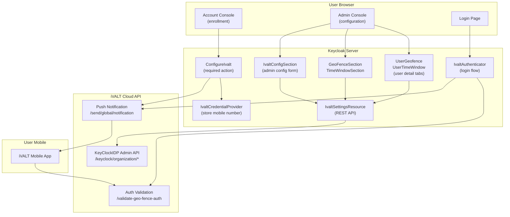

# iVALT MFA — Keycloak Integration

iVALT provides push-notification-based biometric authentication as a Keycloak MFA provider. During login, a push notification is sent to the user's mobile device, and they approve/reject biometrically.

## Architecture

## Key Components

| Component | Type | Location | Purpose |
|-----------|------|----------|---------|
| `IvaltAuthenticator` | Java SPI | `services/.../browser/` | Login flow — sends push, polls for approval |
| `ConditionalIvaltAuthenticator` | Java SPI | `services/.../browser/` | Self-service variant — only runs if user has iVALT configured |
| `ConfigureIvalt` | Java SPI | `services/.../requiredactions/` | User enrollment — collects mobile number, verifies via push |
| `IvaltCredentialProvider` | Java SPI | `services/.../credential/` | Stores mobile number + country code as a Keycloak credential |
| `IvaltSettingsResource` | Java REST | `services/.../admin/` | Admin API — geofence/timewindow CRUD, config management |
| `IvaltApiClient` | Java HTTP | `services/.../browser/` | Auth API client — sends push, validates auth |
| `KeyClockIDPApiClient` | Java HTTP | `services/.../browser/` | Admin API client — geofence/timewindow CRUD |
| `IvaltConfigSection` | React | `js/apps/admin-ui/src/ivalt-settings/` | Config form (org code, mobile, API key, base URL) |
| `GeoFenceSection` | React | `js/apps/admin-ui/src/ivalt-settings/` | Geofence management page |
| `TimeWindowSection` | React | `js/apps/admin-ui/src/ivalt-settings/` | Time window management page |
| `GeofenceList/Table/Form` | React | `js/apps/admin-ui/src/ivalt-settings/geofence/` | Geofence CRUD components |
| `TimeWindowList/Table/Form` | React | `js/apps/admin-ui/src/ivalt-settings/timewindow/` | Time window CRUD components |
| `GoogleMapPicker` | React | `js/apps/admin-ui/src/ivalt-settings/geofence/` | Map-based radius picker for geofences |
| `UserGeofence` | React | `js/apps/admin-ui/src/user/` | User detail tab — assign/unassign geofences |
| `UserTimeWindow` | React | `js/apps/admin-ui/src/user/` | User detail tab — assign/unassign time windows |
| `KeyClockIDPClient` | TypeScript | `js/apps/admin-ui/src/ivalt-settings/api/` | Authenticated API client for admin REST endpoints |

## Docs

| Doc | Description |
|-----|-------------|
| [Authentication Flow](authentication-flow.md) | Login flow and enrollment sequence diagrams |
| [Admin Console UI](admin-console-ui.md) | Admin UI components, routing, navigation |
| [Backend API](backend-api.md) | REST API endpoints, config model, data flow |
| [Setup Guide](setup-guide.md) | Building, deployment, and configuration |
