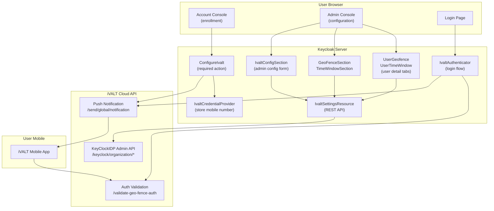

# iVALT MFA — Keycloak Integration

iVALT provides push-notification-based biometric authentication as a Keycloak MFA provider. During login, a push notification is sent to the user's mobile device, and they approve or reject using their fingerprint or face. This eliminates the need for OTP codes, QR code scanning, or hardware tokens.

The system also supports geofencing (restricting authentication to specific physical locations) and time windows (restricting authentication to specific hours) for granular access control policies.

## Architecture

The iVALT integration connects four environments: the user's browser, the Keycloak server, the iVALT Cloud API, and the user's mobile device running the iVALT app.

The **User Browser** hosts three interfaces: the Login Page where users authenticate, the Account Console where users enroll in iVALT MFA, and the Admin Console where administrators configure settings.

Inside **Keycloak**, several SPI components handle different responsibilities. The `IvaltAuthenticator` manages the login flow — it sends push notifications and polls for approval status. The `ConfigureIvalt` required action handles user enrollment, collecting the mobile number and verifying via push. The `IvaltCredentialProvider` stores the user's mobile number and country code as a Keycloak credential in the database. On the admin side, `IvaltSettingsResource` exposes a REST API for configuration, geofence, and time window management. The React admin UI (`IvaltConfigSection`, `GeoFenceSection`, `TimeWindowSection`) provides the visual interface for admins to configure these settings.

The **iVALT Cloud API** (`api.ivalt.com`) provides three service endpoints: push notification delivery (`/send/global/notification`), authentication validation with geofence and time window enforcement (`/validate-geo-fence-auth`), and the KeyClockIDP Admin API for CRUD operations on geofences, time windows, and user assignments.

On the **user's mobile device**, the iVALT mobile app receives push notifications, presents biometric prompts (fingerprint/face), and returns approval or rejection to the iVALT Cloud API.

During login, the sequence flows as follows: the browser sends credentials to Keycloak, which checks if the user has a stored iVALT credential. If they do, Keycloak calls the iVALT API to send a push notification, which arrives on the user's mobile device. The user authenticates biometrically on their phone, and Keycloak polls the iVALT API to check the result. Once approved, login proceeds.

For enrollment, the flow starts from the Account Console, triggers the `ConfigureIvalt` required action, which also sends a push and stores the credential upon verification.

Administrators configure the system through the Admin Console UI components, which communicate with the `IvaltSettingsResource` REST API. That API in turn proxies CRUD operations to the iVALT Cloud API's KeyClockIDP Admin endpoints, managing geofences, time windows, and user assignments.

## Key Components

The following table lists every component in the integration, its type (Java SPI, Java REST, Java HTTP, React, or TypeScript), its location in the source tree, and its purpose.

| Component | Type | Location | Purpose |
|-----------|------|----------|---------|
| `IvaltAuthenticator` | Java SPI | `services/.../browser/` | Login flow — sends push, polls for approval |
| `ConditionalIvaltAuthenticator` | Java SPI | `services/.../browser/` | Self-service variant — only runs if user has iVALT configured |
| `ConfigureIvalt` | Java SPI | `services/.../requiredactions/` | User enrollment — collects mobile number, verifies via push |
| `IvaltCredentialProvider` | Java SPI | `services/.../credential/` | Stores mobile number + country code as a Keycloak credential |
| `IvaltSettingsResource` | Java REST | `services/.../admin/` | Admin API — geofence/timewindow CRUD, config management |
| `IvaltApiClient` | Java HTTP | `services/.../browser/` | Auth API client — sends push, validates auth |
| `KeyClockIDPApiClient` | Java HTTP | `services/.../browser/` | Admin API client — geofence/timewindow CRUD |
| `IvaltConfigSection` | React | `js/apps/admin-ui/src/ivalt-settings/` | Config form (org code, mobile, API key, base URL, Google Maps API key) |
| `GeoFenceSection` | React | `js/apps/admin-ui/src/ivalt-settings/` | Geofence management page |
| `TimeWindowSection` | React | `js/apps/admin-ui/src/ivalt-settings/` | Time window management page |
| `GeofenceList/Table/Form` | React | `js/apps/admin-ui/src/ivalt-settings/geofence/` | Geofence CRUD components |
| `TimeWindowList/Table/Form` | React | `js/apps/admin-ui/src/ivalt-settings/timewindow/` | Time window CRUD components |
| `GoogleMapPicker` | React | `js/apps/admin-ui/src/ivalt-settings/geofence/` | Map-based radius picker for geofences |
| `UserGeofence` | React | `js/apps/admin-ui/src/user/` | User detail tab — assign/unassign geofences |
| `UserTimeWindow` | React | `js/apps/admin-ui/src/user/` | User detail tab — assign/unassign time windows |
| `KeyClockIDPClient` | TypeScript | `js/apps/admin-ui/src/ivalt-settings/api/` | Authenticated API client for admin REST endpoints |

## Docs

| Doc | Description |
|-----|-------------|
| [User Flow & Story](user-flow.md) | Complete user journey — admin setup, user enrollment, daily login, benefits |
| [Authentication Flow](authentication-flow.md) | Login flow and enrollment sequence diagrams |
| [Admin Console UI](admin-console-ui.md) | Admin UI components, routing, navigation |
| [Backend API](backend-api.md) | REST API endpoints, config model, data flow |
| [Setup Guide](setup-guide.md) | Building, deployment, and configuration |
