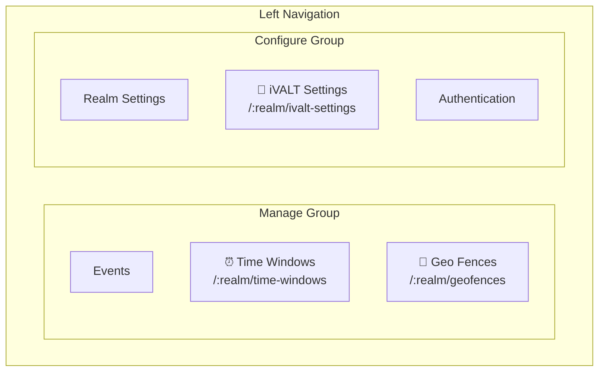
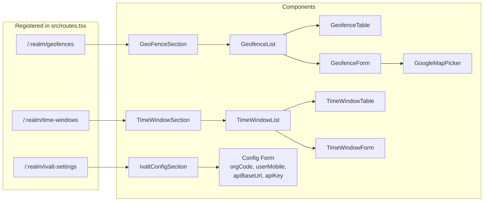
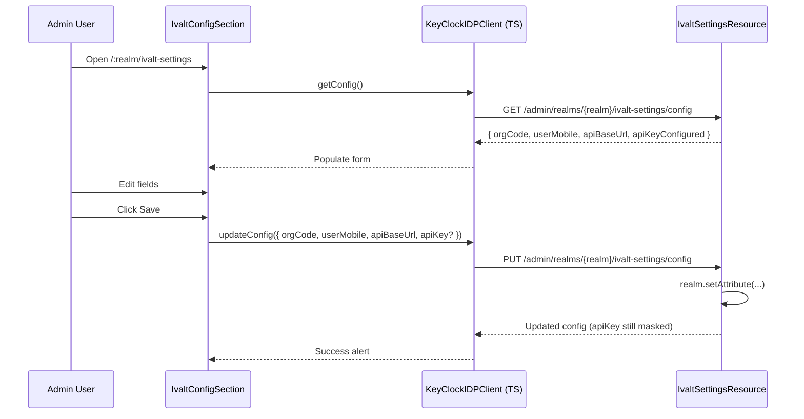
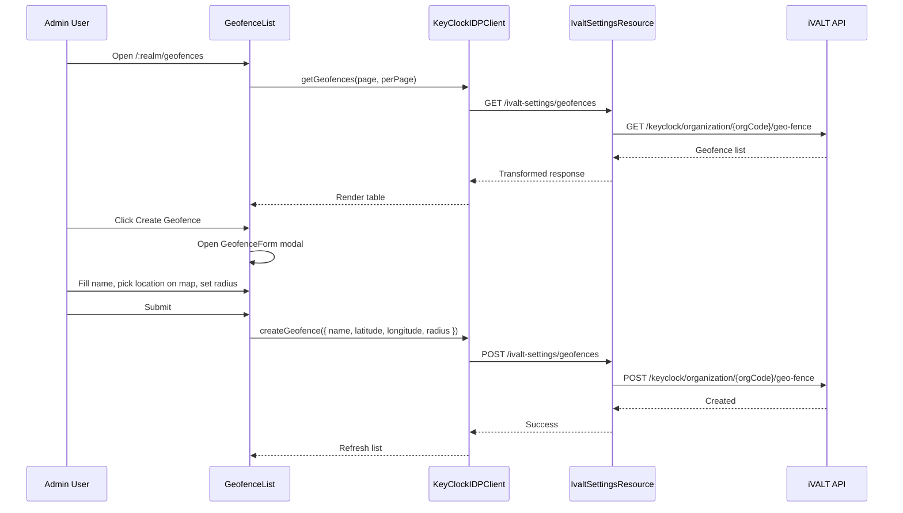
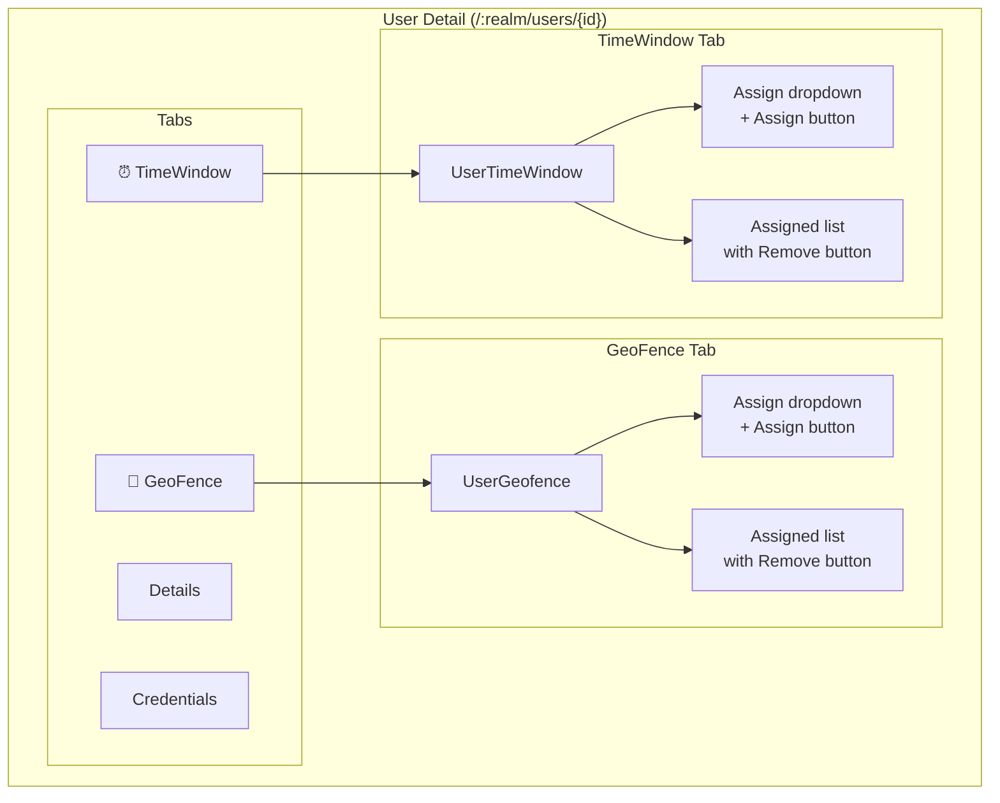
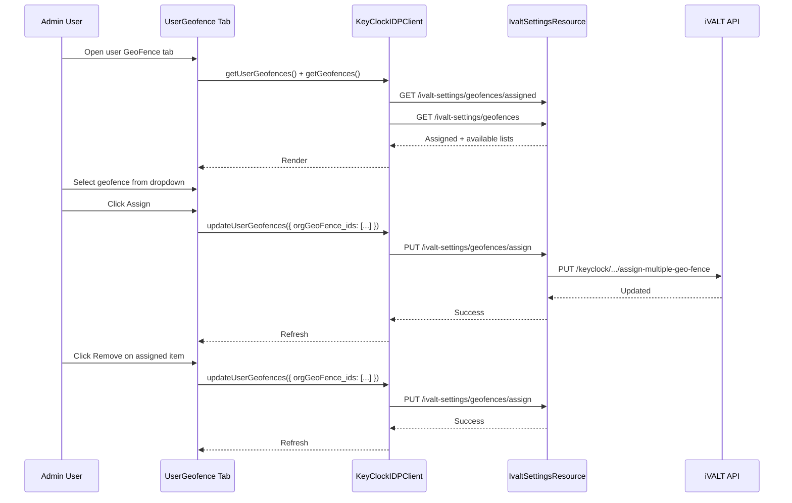

# Admin Console UI

## Navigation Structure

Three iVALT-related items appear in the admin console left navigation:



### Nav Registration (`PageNav.tsx`)

```typescript
// Manage group (after Events)
<LeftNav title="timeWindows" path="/time-windows" />
<LeftNav title="geoFences" path="/geofences" />

// Configure group (after Realm Settings)
<LeftNav title="ivaltSettings" path="/ivalt-settings" />
```

## Route Structure



## iVALT Settings Page (`IvaltConfigSection`)

The config form stores org credentials as realm attributes:

| Field | Realm Attribute | Notes |
|-------|-----------------|-------|
| Org Code | `ivalt.org.code` | Identifies the org in the iVALT API |
| User Mobile | `ivalt.user.mobile` | Owner account for assignments (E.164) |
| API Base URL | `ivalt.api.base.url` | Default: `https://api.ivalt.com` |
| API Key | `ivalt.api.key` | Password field; never echoed back |

**Flow:**



## Geofence Management



## User Detail Tabs

Each user page in the admin console has **GeoFence** and **TimeWindow** tabs for assigning/unassigning restrictions:



**Assign/Unassign flow:**



## Key Files

| File | Role |
|------|------|
| `js/apps/admin-ui/src/ivalt-settings/IvaltConfigSection.tsx` | Config form (org code, mobile, API key, base URL) |
| `js/apps/admin-ui/src/ivalt-settings/GeoFenceSection.tsx` | Geofence page wrapper |
| `js/apps/admin-ui/src/ivalt-settings/TimeWindowSection.tsx` | Time window page wrapper |
| `js/apps/admin-ui/src/ivalt-settings/geofence/GeofenceList.tsx` | Geofence list with pagination |
| `js/apps/admin-ui/src/ivalt-settings/geofence/GeofenceTable.tsx` | Geofence table view |
| `js/apps/admin-ui/src/ivalt-settings/geofence/GeofenceForm.tsx` | Geofence create/edit form (modal) |
| `js/apps/admin-ui/src/ivalt-settings/geofence/GoogleMapPicker.tsx` | Map-based location/radius picker |
| `js/apps/admin-ui/src/ivalt-settings/timewindow/TimeWindowList.tsx` | Time window list with pagination |
| `js/apps/admin-ui/src/ivalt-settings/timewindow/TimeWindowTable.tsx` | Time window table view |
| `js/apps/admin-ui/src/ivalt-settings/timewindow/TimeWindowForm.tsx` | Time window create/edit form (modal) |
| `js/apps/admin-ui/src/ivalt-settings/routes/index.tsx` | Route definitions (3 routes) |
| `js/apps/admin-ui/src/ivalt-settings/api/keyclockidpClient.ts` | Authenticated API client |
| `js/apps/admin-ui/src/ivalt-settings/api/types.ts` | TypeScript types |
| `js/apps/admin-ui/src/user/UserGeofence.tsx` | User detail geofence tab |
| `js/apps/admin-ui/src/user/UserTimeWindow.tsx` | User detail time window tab |
| `js/apps/admin-ui/src/PageNav.tsx` | Left nav (lines 138-139, 146) |
| `js/apps/admin-ui/src/routes.tsx` | Route registry (lines 14, 50) |
