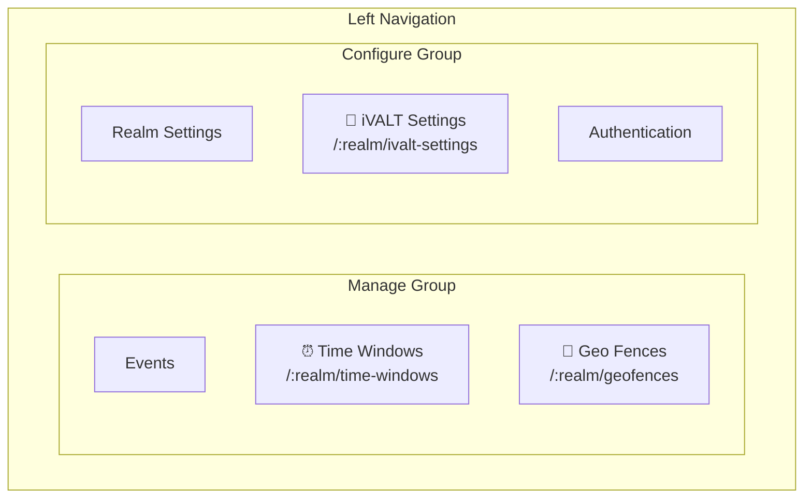
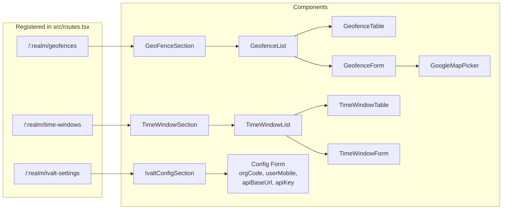
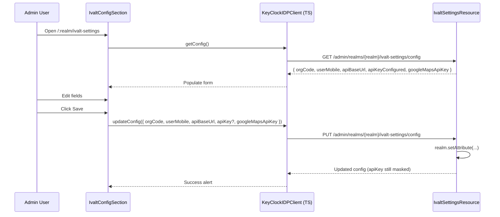
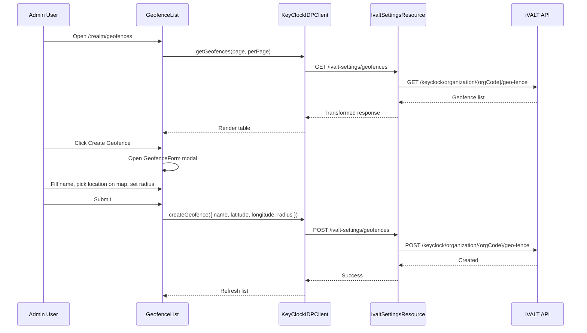
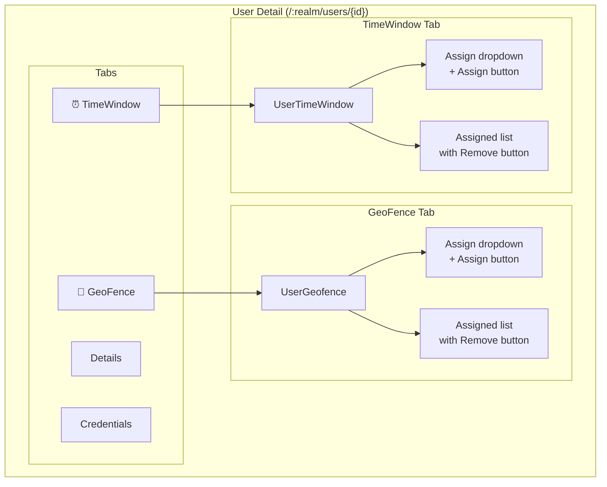
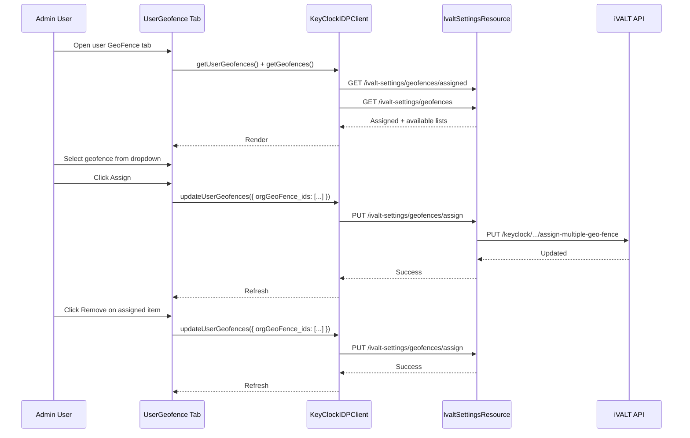

# Admin Console UI

This document describes the React-based admin console interface for managing iVALT settings, geofences, time windows, and user assignments. It covers the navigation structure, route registration, config page, geofence and time window management, and user detail tabs.

---

## Navigation Structure

Three iVALT-related items appear in the Keycloak admin console's left navigation panel, distributed across two groups.

In the **Manage** group (which contains operational settings like Events), two items are added: **Geo Fences** (`/:realm/geofences`) and **Time Windows** (`/:realm/time-windows`). These allow administrators to create, edit, and delete location-based and time-based policies.

In the **Configure** group (which contains structural settings like Realm Settings and Authentication), one item is added: **iVALT Settings** (`/:realm/ivalt-settings`). This is where administrators manage the organization-level credentials needed to communicate with the iVALT Cloud API.



### Nav Registration (`PageNav.tsx`)

The navigation items are registered in `PageNav.tsx` using the `<LeftNav>` component. Each entry specifies the display title (referenced from the i18n messages file) and the route path.

```typescript
// Manage group (after Events)
<LeftNav title="timeWindows" path="/time-windows" />
<LeftNav title="geoFences" path="/geofences" />

// Configure group (after Realm Settings)
<LeftNav title="ivaltSettings" path="/ivalt-settings" />
```

---

## Route Structure

Each navigation item maps to a route registered in `src/routes.tsx`. These routes define the URL pattern, the loader function, and the React component to render.

The `/:realm/ivalt-settings` route renders `IvaltConfigSection`, which contains the org-level configuration form. The `/:realm/geofences` route renders `GeoFenceSection`, which contains the geofence list, table, create/edit form, and the Google Map picker. The `/:realm/time-windows` route renders `TimeWindowSection`, which contains the time window list, table, and create/edit form.



---

## iVALT Settings Page (`IvaltConfigSection`)

The iVALT Settings page is where administrators configure the organization's credentials for the iVALT Cloud API. These values are stored as realm attributes in Keycloak's database, making them specific to each realm.

Five fields are configurable:

| Field | Realm Attribute | Notes |
|-------|-----------------|-------|
| Org Code | `ivalt.org.code` | Identifies the org in the iVALT API |
| User Mobile | `ivalt.user.mobile` | Owner account for assignments (E.164) |
| API Base URL | `ivalt.api.base.url` | Default: `https://api.ivalt.com` |
| API Key | `ivalt.api.key` | Password field; never echoed back |
| Google Maps API Key | `ivalt.google.maps.api.key` | Used for map picker in geofence creation |

The **API Key** is write-only — when the config is fetched, the backend returns `apiKeyConfigured: boolean` rather than the key value itself. This means the key can only be set or overwritten, never read back.

**Flow:** When the admin opens the iVALT Settings page, the `IvaltConfigSection` component calls `KeyClockIDPClient.getConfig()`, which sends a GET request to the backend. The backend reads the realm attributes and returns them (with the API key masked). The admin edits the fields and clicks Save, triggering a PUT request to the backend which updates the realm attributes.



---

## Geofence Management

The geofence management page allows administrators to create, view, edit, and delete geofences. A geofence is defined by a name, a center point (latitude/longitude selected on a Google Map), and a radius in meters.

When the admin opens the Geo Fences page, `GeofenceList` fetches the paginated list from the backend, which proxies the request to the iVALT Cloud API's KeyClockIDP endpoint. The response is transformed from the iVALT format to the frontend format before rendering in a table.

Creating a geofence opens a modal (`GeofenceForm`) that includes the `GoogleMapPicker` component — an interactive Google Map where the admin clicks to set the center point and adjusts a radius slider. The Google Maps API key is loaded from the iVALT settings configuration. On submit, the data is sent to the backend, which creates the geofence via the iVALT API and returns the result.



---

## User Detail Tabs

Each user detail page in the admin console (`/:realm/users/{id}`) includes two additional tabs: **GeoFence** and **TimeWindow**. These tabs allow administrators to assign or unassign geofences and time windows to individual users.

The **GeoFence Tab** (`UserGeofence`) shows a dropdown of available geofences (all geofences created for the org, minus ones already assigned to this user) with an Assign button, and a list of currently assigned geofences with Remove buttons.

The **TimeWindow Tab** (`UserTimeWindow`) works identically — a dropdown of available time windows, an Assign button, and an assigned list with Remove buttons.



**Assign/Unassign flow:** When the admin opens a user's GeoFence tab, the tab fetches both the currently assigned geofences and the full list of available geofences. The admin selects a geofence from the dropdown and clicks Assign, which sends a PUT request with the updated assignment list. The backend proxies this to the iVALT API. The same flow applies to time windows.



---

## Key Files

| File | Role |
|------|------|
| `js/apps/admin-ui/src/ivalt-settings/IvaltConfigSection.tsx` | Config form (org code, mobile, API key, base URL) |
| `js/apps/admin-ui/src/ivalt-settings/GeoFenceSection.tsx` | Geofence page wrapper |
| `js/apps/admin-ui/src/ivalt-settings/TimeWindowSection.tsx` | Time window page wrapper |
| `js/apps/admin-ui/src/ivalt-settings/geofence/GeofenceList.tsx` | Geofence list with pagination |
| `js/apps/admin-ui/src/ivalt-settings/geofence/GeofenceTable.tsx` | Geofence table view |
| `js/apps/admin-ui/src/ivalt-settings/geofence/GeofenceForm.tsx` | Geofence create/edit form (modal) |
| `js/apps/admin-ui/src/ivalt-settings/geofence/GoogleMapPicker.tsx` | Map-based location/radius picker |
| `js/apps/admin-ui/src/ivalt-settings/timewindow/TimeWindowList.tsx` | Time window list with pagination |
| `js/apps/admin-ui/src/ivalt-settings/timewindow/TimeWindowTable.tsx` | Time window table view |
| `js/apps/admin-ui/src/ivalt-settings/timewindow/TimeWindowForm.tsx` | Time window create/edit form (modal) |
| `js/apps/admin-ui/src/ivalt-settings/routes/index.tsx` | Route definitions (3 routes) |
| `js/apps/admin-ui/src/ivalt-settings/api/keyclockidpClient.ts` | Authenticated API client |
| `js/apps/admin-ui/src/ivalt-settings/api/types.ts` | TypeScript types |
| `js/apps/admin-ui/src/user/UserGeofence.tsx` | User detail geofence tab |
| `js/apps/admin-ui/src/user/UserTimeWindow.tsx` | User detail time window tab |
| `js/apps/admin-ui/src/PageNav.tsx` | Left nav (lines 138-139, 146) |
| `js/apps/admin-ui/src/routes.tsx` | Route registry (lines 14, 50) |
