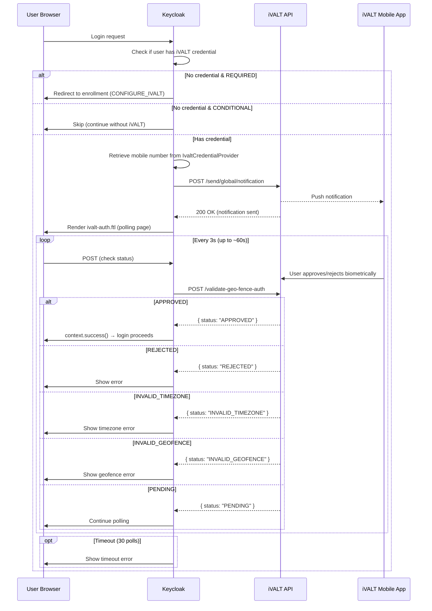
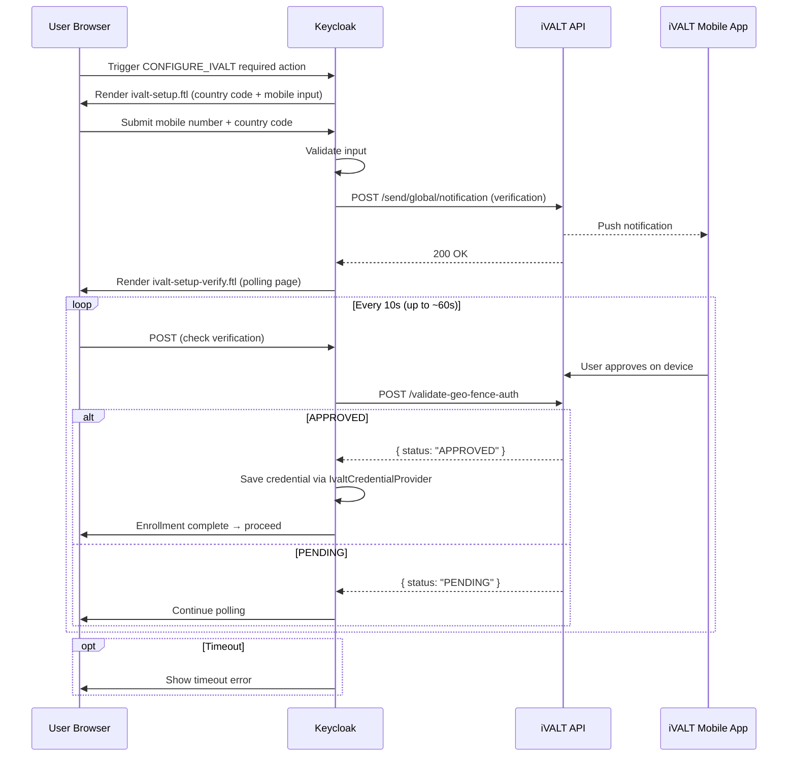
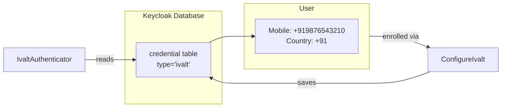

# Authentication Flow

This document describes the two main user-facing flows in the iVALT MFA integration: the login flow (MFA challenge) and the enrollment flow (required action). It also explains how credentials are stored and which files implement each step.

---

## Login Flow (MFA Challenge)

When a user reaches the iVALT authenticator during login, Keycloak first checks whether the user has an iVALT credential stored in its database. The behavior depends on both the credential status and the authenticator configuration.

If the user has **no credential** and the authenticator is configured as **REQUIRED**, they are redirected to the enrollment flow to set up iVALT. If the authenticator is **CONDITIONAL**, the iVALT step is skipped entirely and login proceeds without it — this is useful for self-service deployments where users opt in to MFA.

If the user **has a credential** (they enrolled previously), Keycloak retrieves their mobile number from the `IvaltCredentialProvider`. It then calls the iVALT Cloud API to send a push notification to the user's device. The user sees a waiting page (`ivalt-auth.ftl`) with a spinner and the message "A notification has been sent to your device."

The user receives the push notification on their phone, taps it, and authenticates with their fingerprint or face via the iVALT mobile app. Meanwhile, Keycloak polls the iVALT API every 3 seconds (for up to 60 seconds) to check the auth status.

The polling can resolve in several ways:

- **APPROVED:** The user authenticated successfully on their device. Keycloak calls `context.success()` and login proceeds.
- **REJECTED:** The user explicitly rejected the request on their phone. Keycloak shows an error message.
- **INVALID_TIMEZONE:** The current time falls outside the user's assigned time windows. The auth is denied with a timezone error.
- **INVALID_GEOFENCE:** The user's current location is outside their assigned geofences. The auth is denied with a geofence error.
- **PENDING:** The user has not yet responded. Keycloak continues polling.
- **TIMEOUT:** After approximately 60 seconds (30 polls × 2 seconds interval), if no response is received, Keycloak shows a timeout error.

### Authenticator Provider IDs

There are two authenticator variants available in the Keycloak authentication flow configuration. They differ in how they handle users who have not yet enrolled in iVALT.

| Provider ID | Class | Requirement |
|-------------|-------|-------------|
| `ivalt-authenticator` | `IvaltAuthenticator` | REQUIRED — always executes, forces enrollment |
| `ivalt-mfa-conditional` | `ConditionalIvaltAuthenticator` | CONDITIONAL — skips if user hasn't configured iVALT |

Choose `ivalt-authenticator` when MFA is mandatory for all users. Choose `ivalt-mfa-conditional` when you want a self-service model where only users who voluntarily enroll use iVALT, and others can log in without it.

---

## Enrollment Flow (Required Action)

Enrollment happens when a user who does not have an iVALT credential needs to set one up. This is triggered automatically when the authenticator is REQUIRED and no credential exists, or when a user explicitly chooses to enroll from their account console.

Keycloak first renders the enrollment form (`ivalt-setup.ftl`), which presents a simple form with a country code dropdown and a mobile number input field. The user enters their mobile number and submits.

Keycloak validates the input, then calls the iVALT Cloud API to send a verification push notification to the user's device. The user sees a verification waiting page (`ivalt-setup-verify.ftl`) with a polling indicator.

The user receives the push notification on their phone and approves it using their fingerprint or face. Keycloak polls the iVALT API every 10 seconds (for up to 60 seconds) to check verification status. Once approved, Keycloak saves the mobile number and country code as an `ivalt`-type credential via `IvaltCredentialProvider`, and the enrollment is complete. The user then proceeds with their original login flow.

If the polling times out with no response, a timeout error is shown and the user can retry.

---

## Credential Storage

The `IvaltCredentialProvider` stores the user's mobile number and country code as a typed Keycloak credential in the database. This credential is written during enrollment (by `ConfigureIvalt`) and read during login (by `IvaltAuthenticator`).

- **Credential type:** `ivalt`
- **Stored data:** JSON with `mobileNumber` and `countryCode`
- **Provider ID:** `keycloak-ivalt`

The credential is stored in Keycloak's standard `credential` table, which means it participates in the usual credential lifecycle — it appears in the user's credential list, it can be removed by admins, and it is scoped to the user's realm.

---

## Key Files

The following files implement the authentication and enrollment flows. They are organized by layer — authenticators handle the login flow, required actions handle enrollment, the credential provider handles storage, and the FreeMarker templates handle the user interface.

| File | Role |
|------|------|
| `services/.../browser/IvaltAuthenticator.java` | Main authenticator — sends push, polls for status, renders `ivalt-auth.ftl` |
| `services/.../browser/IvaltAuthenticatorFactory.java` | Factory (provider ID: `ivalt-authenticator`) |
| `services/.../browser/ConditionalIvaltAuthenticator.java` | Conditional variant — checks credential before executing |
| `services/.../browser/ConditionalIvaltAuthenticatorFactory.java` | Factory (provider ID: `ivalt-mfa-conditional`) |
| `services/.../browser/IvaltApiClient.java` | Auth API client — `/send/global/notification`, `/validate-geo-fence-auth` |
| `services/.../requiredactions/ConfigureIvalt.java` | Required action — enrollment form + verification |
| `services/.../credential/IvaltCredentialProvider.java` | Credential provider — store/retrieve mobile number |
| `themes/.../login/ivalt-auth.ftl` | Auth waiting page (polls every 3s) |
| `themes/.../login/ivalt-setup.ftl` | Enrollment form (country code + mobile input) |
| `themes/.../login/ivalt-setup-verify.ftl` | Verification waiting page (polls every 10s) |
| `themes/.../login/messages/messages_en.properties` | i18n strings for all iVALT flows |
