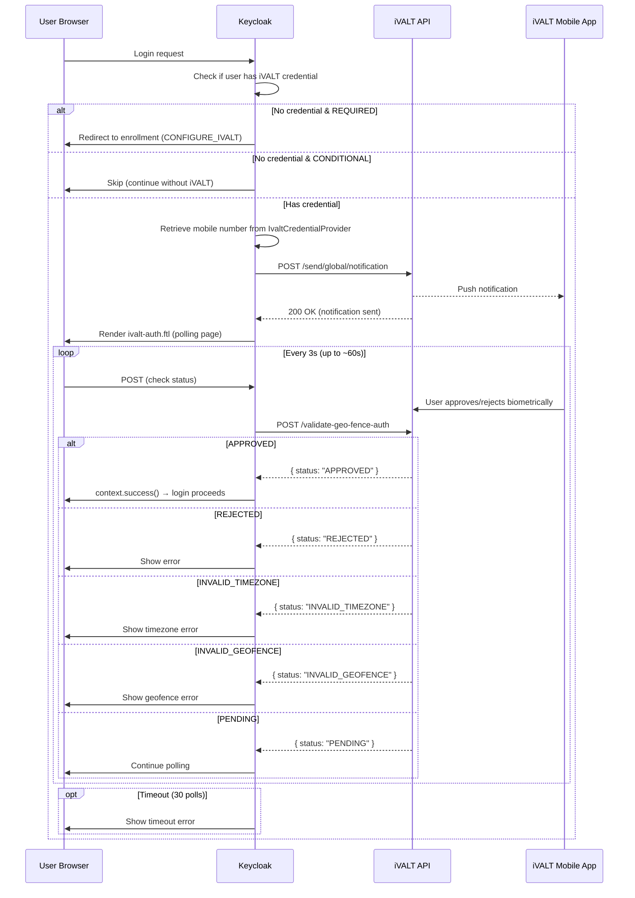
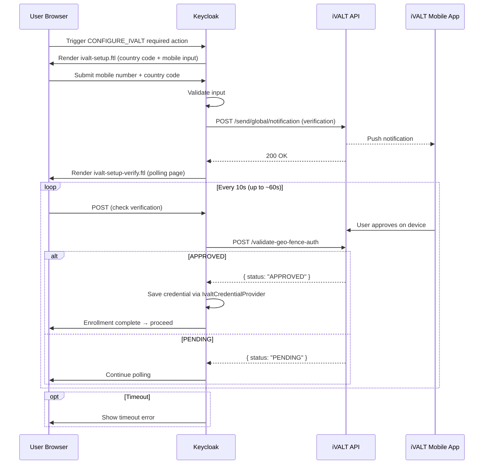
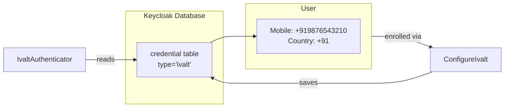

# Authentication Flow

## Login Flow (MFA Challenge)

When a user reaches the iVALT authenticator during login:

### Authenticator Provider IDs

| Provider ID | Class | Requirement |
|-------------|-------|-------------|
| `ivalt-authenticator` | `IvaltAuthenticator` | REQUIRED — always executes, forces enrollment |
| `ivalt-mfa-conditional` | `ConditionalIvaltAuthenticator` | CONDITIONAL — skips if user hasn't configured iVALT |

## Enrollment Flow (Required Action)

When a user needs to set up iVALT MFA:

## Credential Storage

The `IvaltCredentialProvider` stores the mobile number and country code as a typed Keycloak credential:

- **Credential type:** `ivalt`
- **Stored data:** JSON with `mobileNumber` and `countryCode`
- **Provider ID:** `keycloak-ivalt`

## Key Files

| File | Role |
|------|------|
| `services/.../browser/IvaltAuthenticator.java` | Main authenticator — sends push, polls for status, renders `ivalt-auth.ftl` |
| `services/.../browser/IvaltAuthenticatorFactory.java` | Factory (provider ID: `ivalt-authenticator`) |
| `services/.../browser/ConditionalIvaltAuthenticator.java` | Conditional variant — checks credential before executing |
| `services/.../browser/ConditionalIvaltAuthenticatorFactory.java` | Factory (provider ID: `ivalt-mfa-conditional`) |
| `services/.../browser/IvaltApiClient.java` | Auth API client — `/send/global/notification`, `/validate-geo-fence-auth` |
| `services/.../requiredactions/ConfigureIvalt.java` | Required action — enrollment form + verification |
| `services/.../credential/IvaltCredentialProvider.java` | Credential provider — store/retrieve mobile number |
| `themes/.../login/ivalt-auth.ftl` | Auth waiting page (polls every 3s) |
| `themes/.../login/ivalt-setup.ftl` | Enrollment form (country code + mobile input) |
| `themes/.../login/ivalt-setup-verify.ftl` | Verification waiting page (polls every 10s) |
| `themes/.../login/messages/messages_en.properties` | i18n strings for all iVALT flows |
