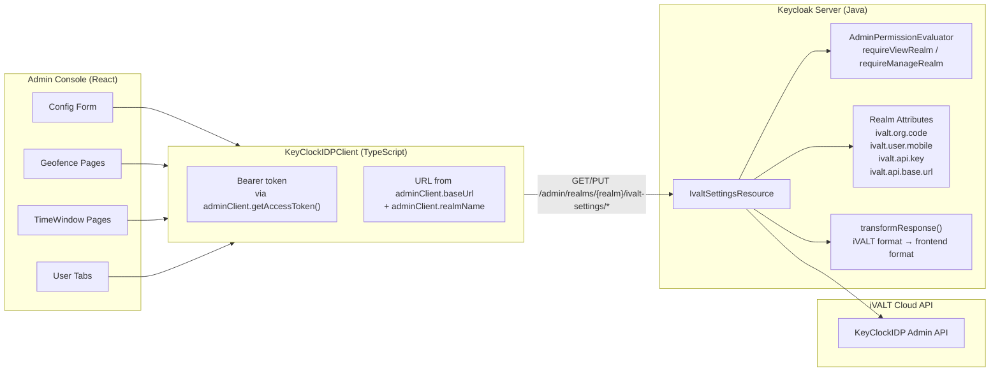

# Backend API

## Configuration Model

Credentials are stored as realm attributes in Keycloak's database:

| Attribute | Key | Set via | Used by |
|-----------|-----|---------|---------|
| Org code | `ivalt.org.code` | Admin UI config form | Geofence/timewindow CRUD (identifies org) |
| User mobile | `ivalt.user.mobile` | Admin UI config form | Assign/unassign endpoints (owner account) |
| API key | `ivalt.api.key` | Admin UI config form (write-only) | All iVALT API calls |
| API base URL | `ivalt.api.base.url` | Admin UI config form | API client base URL (default: `https://api.ivalt.com`) |

## REST Endpoints

All endpoints are under `/admin/realms/{realm}/ivalt-settings/` and scoped by realm.

### Configuration

| Method | Path | Auth | Description |
|--------|------|------|-------------|
| `GET` | `config` | `viewRealm` | Get config — returns `{ orgCode, userMobile, apiBaseUrl, apiKeyConfigured }`. API key value is **never** returned (only `apiKeyConfigured: boolean`). |
| `PUT` | `config` | `manageRealm` | Update config — accepts `{ orgCode, userMobile, apiBaseUrl, apiKey? }`. API key only overwritten when non-empty. |

### Geofences

| Method | Path | Auth | Description |
|--------|------|------|-------------|
| `GET` | `geofences` | `viewRealm` | List all geofences for the configured org |
| `POST` | `geofences` | `manageRealm` | Create a geofence |
| `PUT` | `geofences/{id}` | `manageRealm` | Update a geofence |
| `DELETE` | `geofences/{id}` | `manageRealm` | Delete a geofence |
| `GET` | `geofences/assigned` | `viewRealm` | List geofences assigned to the configured user |
| `PUT` | `geofences/assign` | `manageRealm` | Update user geofence assignments |

### Time Windows

| Method | Path | Auth | Description |
|--------|------|------|-------------|
| `GET` | `timewindows` | `viewRealm` | List all timeslots for the configured org |
| `POST` | `timewindows` | `manageRealm` | Create a timeslot |
| `PUT` | `timewindows/{id}` | `manageRealm` | Update a timeslot |
| `DELETE` | `timewindows/{id}` | `manageRealm` | Delete a timeslot |
| `GET` | `timewindows/assigned` | `viewRealm` | List timeslots assigned to the configured user |
| `PUT` | `timewindows/assign` | `manageRealm` | Update user timeslot assignments |

## Data Flow



## Response Transformation

The backend transforms the iVALT API response format to what the frontend expects:

```
iVALT API response:
  { data: { status, message, details }, meta, error: { detail, title } }

Transformed response:
  { success, data, message?, meta?, error? }
```

- `data.status` → `success` (boolean)
- `data.details` → `data` (the actual payload)
- `data.message` → `message`
- `error.detail` → `error` (with fallback to `error.title`, then "Unknown error")

## Error Responses

| HTTP Status | Condition | Body |
|-------------|-----------|------|
| 200 | Success | `{ success: true, data: ..., meta?: ... }` |
| 200 | iVALT API error relayed | `{ success: false, error: "..." }` |
| 400 | Missing config | `{ success: false, error: "iVALT organization code is not configured." }` |
| 403 | Not authorized | Keycloak default 403 |
| 500 | Server/API error | `{ success: false, error: "..." }` |

## Key Implementation Files

| File | Role |
|------|------|
| `services/.../admin/IvaltSettingsResource.java` | REST resource — all config/geofence/timewindow endpoints |
| `services/.../browser/KeyClockIDPApiClient.java` | Admin API client — proxies to iVALT KeyClockIDP API |
| `services/.../browser/AbstractIvaltApiClient.java` | Base HTTP client — generic POST/GET/PUT/DELETE + error handling |
| `services/.../browser/IvaltAuthenticatorFactory.java` | Config constants (API base URL, API key, timeout attr names) |
| `server-spi/.../credential/IvaltCredentialModel.java` | Credential model (mobile number + country code) |
| `services/.../admin/RealmAdminResource.java` | Parent resource — registers `/ivalt-settings` sub-resource (line 247) |
