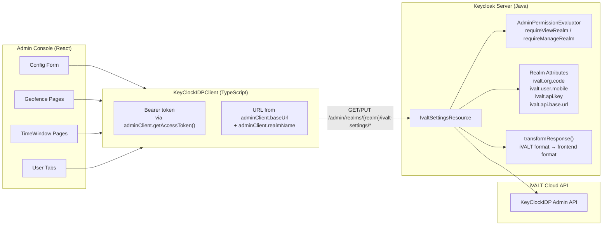

# Backend API

This document describes the REST API exposed by the Keycloak backend for iVALT configuration management. It covers the configuration model (realm attributes), all REST endpoints with their authentication requirements, the data flow between frontend and backend, response transformation, and error handling.

---

## Configuration Model

iVALT credentials are stored as Keycloak realm attributes — key-value pairs associated with each realm in the Keycloak database. This means settings are scoped per realm, allowing different configurations for different environments or organizations within the same Keycloak instance.

Four attributes are used:

| Attribute | Key | Set via | Used by |
|-----------|-----|---------|---------|
| Org code | `ivalt.org.code` | Admin UI config form | Geofence/timewindow CRUD (identifies org) |
| User mobile | `ivalt.user.mobile` | Admin UI config form | Assign/unassign endpoints (owner account) |
| API key | `ivalt.api.key` | Admin UI config form (write-only) | All iVALT API calls |
| API base URL | `ivalt.api.base.url` | Admin UI config form | API client base URL (default: `https://api.ivalt.com`) |

The **Org code** identifies the organization within the iVALT Cloud API and is required for all geofence and time window operations. The **User mobile** is the admin/owner account used as the identity for assignment operations. The **API key** authenticates all requests to the iVALT API and is write-only — it is never returned in GET responses. The **API base URL** defaults to `https://api.ivalt.com` but can be overridden for testing or custom deployments.

---

## REST Endpoints

All endpoints are relative to `/admin/realms/{realm}/ivalt-settings/` and are scoped by realm. They require Keycloak admin authentication with specific realm-management roles.

### Configuration

Two endpoints handle reading and writing the realm-level iVALT configuration:

| Method | Path | Auth | Description |
|--------|------|------|-------------|
| `GET` | `config` | `viewRealm` | Get config — returns `{ orgCode, userMobile, apiBaseUrl, apiKeyConfigured }`. API key value is **never** returned (only `apiKeyConfigured: boolean`). |
| `PUT` | `config` | `manageRealm` | Update config — accepts `{ orgCode, userMobile, apiBaseUrl, apiKey? }`. API key only overwritten when non-empty. |

The GET endpoint returns a boolean `apiKeyConfigured` instead of the actual key value for security — the frontend only needs to know whether a key has been set. The PUT endpoint only updates the API key when the field is non-empty, allowing the admin to update other fields without re-entering the key.

### Geofences

Geofence endpoints manage location-based access policies. They proxy requests to the iVALT Cloud API's KeyClockIDP admin endpoints.

| Method | Path | Auth | Description |
|--------|------|------|-------------|
| `GET` | `geofences` | `viewRealm` | List all geofences for the configured org |
| `POST` | `geofences` | `manageRealm` | Create a geofence |
| `PUT` | `geofences/{id}` | `manageRealm` | Update a geofence |
| `DELETE` | `geofences/{id}` | `manageRealm` | Delete a geofence |
| `GET` | `geofences/assigned` | `viewRealm` | List geofences assigned to the configured user |
| `PUT` | `geofences/assign` | `manageRealm` | Update user geofence assignments |

The `assign` endpoint takes a list of geofence IDs and replaces all assignments for the user — it is a full replacement, not an incremental add/remove. The frontend handles the logic of computing the updated list before sending it.

### Time Windows

Time window endpoints manage time-based access policies. They follow the same pattern as the geofence endpoints.

| Method | Path | Auth | Description |
|--------|------|------|-------------|
| `GET` | `timewindows` | `viewRealm` | List all timeslots for the configured org |
| `POST` | `timewindows` | `manageRealm` | Create a timeslot |
| `PUT` | `timewindows/{id}` | `manageRealm` | Update a timeslot |
| `DELETE` | `timewindows/{id}` | `manageRealm` | Delete a timeslot |
| `GET` | `timewindows/assigned` | `viewRealm` | List timeslots assigned to the configured user |
| `PUT` | `timewindows/assign` | `manageRealm` | Update user timeslot assignments |

---

## Data Flow

The data flow involves four layers: the React frontend components, the TypeScript API client (`KeyClockIDPClient`), the Java backend REST resource (`IvaltSettingsResource`), and the external iVALT Cloud API.

The frontend components call methods on `KeyClockIDPClient`, which attaches a Keycloak bearer token (obtained via `adminClient.getAccessToken()`) and constructs the URL from the admin client's base URL and realm name. Requests are sent to the backend's `IvaltSettingsResource`.

On the backend side, `IvaltSettingsResource` first checks authorization via `AdminPermissionEvaluator` (requiring `viewRealm` or `manageRealm` depending on the operation). It reads configuration from realm attributes, and for geofence/time window operations, it proxies the request to the iVALT Cloud API's KeyClockIDP Admin API. Responses from the iVALT API are transformed from their native format to the frontend format before being returned.



---

## Response Transformation

The iVALT Cloud API uses a different response format than what the frontend expects. The backend's `transformResponse()` method handles this conversion.

The iVALT API wraps its responses in a `data` object containing `status`, `message`, and `details` fields, with optional `meta` and `error` fields. The backend transforms this into a flat structure that the frontend can consume uniformly.

```
iVALT API response:
  { data: { status, message, details }, meta, error: { detail, title } }

Transformed response:
  { success, data, message?, meta?, error? }
```

The transformation logic is:
- `data.status` maps to `success` (converted to boolean)
- `data.details` maps to `data` (the actual payload)
- `data.message` maps to `message`
- `error.detail` maps to `error` (with fallback to `error.title`, then "Unknown error")

---

## Error Responses

The backend returns consistent error responses across all endpoints. The HTTP status code indicates the category of error, while the body provides the specific error message.

| HTTP Status | Condition | Body |
|-------------|-----------|------|
| 200 | Success | `{ success: true, data: ..., meta?: ... }` |
| 200 | iVALT API error relayed | `{ success: false, error: "..." }` |
| 400 | Missing config | `{ success: false, error: "iVALT organization code is not configured." }` |
| 403 | Not authorized | Keycloak default 403 |
| 500 | Server/API error | `{ success: false, error: "..." }` |

Note that the backend returns HTTP 200 even when the iVALT API returns an error — the success/failure is communicated in the response body's `success` field. This allows the frontend to handle all responses uniformly. A 400 response specifically indicates that required configuration (org code or API key) is missing. A 500 response indicates an unexpected server error or an unreachable iVALT API.

---

## Key Implementation Files

| File | Role |
|------|------|
| `services/.../admin/IvaltSettingsResource.java` | REST resource — all config/geofence/timewindow endpoints |
| `services/.../browser/KeyClockIDPApiClient.java` | Admin API client — proxies to iVALT KeyClockIDP API |
| `services/.../browser/AbstractIvaltApiClient.java` | Base HTTP client — generic POST/GET/PUT/DELETE + error handling |
| `services/.../browser/IvaltAuthenticatorFactory.java` | Config constants (API base URL, API key, timeout attr names) |
| `server-spi/.../credential/IvaltCredentialModel.java` | Credential model (mobile number + country code) |
| `services/.../admin/RealmAdminResource.java` | Parent resource — registers `/ivalt-settings` sub-resource (line 247) |
