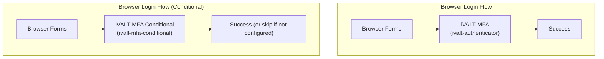

# Setup Guide

## Building from Source

### Prerequisites

- Java 17+
- Maven 3.8+
- Node.js 18+ (for admin console)

### Quick Build (iVALT-only)

To compile only the iVALT classes (fastest):

```bash
# From the project root
./compile-ivalt-only.bat   # Windows
```

This compiles the `server-spi` and `services` Maven modules.

### Full Build

```bash
# Build everything (takes longer)
mvn clean install -DskipTests
```

### Create Provider JAR

```bash
./create-ivalt-jar.bat
```

Creates `keycloak-ivalt-mfa.jar` — a standalone provider JAR containing:

- Compiled iVALT classes
- SPI service registration files (`META-INF/services/`)
- FreeMarker templates (`ivalt-auth.ftl`, `ivalt-setup.ftl`, `ivalt-setup-verify.ftl`)
- i18n messages

## Deployment

### Standalone Keycloak

1. Copy the JAR to Keycloak's providers directory:
   ```bash
   cp keycloak-ivalt-mfa.jar /path/to/keycloak/providers/
   ```

2. Rebuild Keycloak:
   ```bash
   /path/to/keycloak/bin/kc.sh build
   ```

3. Start Keycloak:
   ```bash
   /path/to/keycloak/bin/kc.sh start-dev
   ```

### Automated Deployment (Self-Service)

```bash
./deploy-ivalt-selfservice.bat
```

This runs: compile → create JAR → copy to `providers/`.

### Admin Console

The admin console UI is part of the main Keycloak build (`js/apps/admin-ui/`). To rebuild after changes:

```bash
cd js/apps/admin-ui
npm run build
```

> Note: If you're running in dev mode, the admin console hot-reloads automatically.

## Configuration

### 1. Verify iVALT is loaded

- Login to the admin console
- Go to **Authentication** → **Flows**
- Click **Add execution** — look for "iVALT MFA" in the provider list

### 2. Configure authenticator settings

When adding the iVALT execution to a flow, configure:

| Setting | Value | Notes |
|---------|-------|-------|
| API Base URL | `https://api.ivalt.com` | iVALT cloud API |
| API Key | *(your key)* | Provided by iVALT |
| API Timeout | `300000` | 5 minutes in milliseconds |
| Poll Interval | `2000` | 2 seconds between polls |

### 3. Configure admin settings

Navigate to the realm's **iVALT Settings** page (Configure group):

| Field | Notes |
|-------|-------|
| Org Code | Organization identifier (e.g. `iVALT`) |
| User Mobile | Owner mobile in E.164 format (e.g. `+919876543210`) |
| API Base URL | Default: `https://api.ivalt.com` |
| API Key | Write-only; masked in UI |

### 4. Configure flows

There are two authenticator variants:



| Variant | Requirement | Behavior |
|---------|-------------|----------|
| `ivalt-authenticator` | REQUIRED | Always executes. Redirects unconfigured users to enrollment. |
| `ivalt-mfa-conditional` | CONDITIONAL | Only executes if user has iVALT configured. Skips otherwise. |

### 5. Configure geofences and time windows

Once the admin settings (org code, user mobile) are saved:

1. Go to **Manage** → **Geo Fences** — create geofences with map-based radius picker
2. Go to **Manage** → **Time Windows** — create time windows with time ranges
3. Open a user → **GeoFence** tab — assign/unassign geofences
4. Open a user → **TimeWindow** tab — assign/unassign time windows

## Troubleshooting

| Symptom | Likely Cause | Fix |
|---------|-------------|-----|
| iVALT not in provider list | JAR not deployed or not rebuilt | Run `kc.sh build` and restart |
| API errors | API key not configured | Check iVALT Settings page |
| Push not received | Wrong mobile number | Re-enroll user with correct mobile |
| "Invalid Timezone" error | Timezone restriction active | Check assigned time windows |
| "Invalid Geofence" error | Location restriction active | Check assigned geofences |
| Config page shows errors | API key or base URL misconfigured | Update in iVALT Settings page |

## SPI Registration Files

The JAR includes service registration files in `META-INF/services/`:

| File | Registers |
|------|-----------|
| `org.keycloak.authentication.AuthenticatorFactory` | `IvaltAuthenticatorFactory`, `ConditionalIvaltAuthenticatorFactory` |
| `org.keycloak.authentication.RequiredActionFactory` | `ConfigureIvalt` |
| `org.keycloak.credential.CredentialProviderFactory` | `IvaltCredentialProviderFactory` |

These files are in the `ivalt-spi/` directory at the project root.
