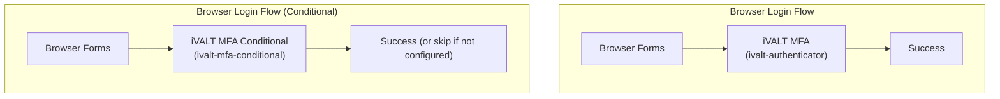

# Setup Guide

This guide covers building the iVALT MFA provider from source, deploying it to Keycloak, and configuring the authentication flow, admin settings, geofences, and time windows. It also includes troubleshooting tips for common issues.

---

## Building from Source

### Prerequisites

Before building, ensure your environment has the required tooling. The iVALT Java components require Java 17+ and Maven 3.8+. The admin console UI (React) requires Node.js 18+.

- Java 17+
- Maven 3.8+
- Node.js 18+ (for admin console)

### Quick Build (iVALT-only)

If you only need to compile the iVALT classes without rebuilding the entire Keycloak project, use the quick build script. This is the fastest option during development.

```bash
# From the project root
./compile-ivalt-only.bat   # Windows
```

This compiles the `server-spi` and `services` Maven modules, which contain all the iVALT Java SPIs (authenticators, required actions, credential provider, API clients, and admin REST resource).

### Full Build

If you need to rebuild the entire project (e.g., for a clean deployment or if you've modified dependencies), run a full Maven build.

```bash
mvn clean install -DskipTests
```

### Create Provider JAR

Once the classes are compiled, package them into a standalone provider JAR. This JAR contains everything Keycloak needs to load the iVALT provider.

```bash
./create-ivalt-jar.bat
```

Creates `keycloak-ivalt-mfa.jar` — a standalone provider JAR containing:

- Compiled iVALT classes
- SPI service registration files (`META-INF/services/`)
- FreeMarker templates (`ivalt-auth.ftl`, `ivalt-setup.ftl`, `ivalt-setup-verify.ftl`)
- i18n messages

---

## Deployment

### Standalone Keycloak

To deploy the iVALT provider to a standalone Keycloak instance, copy the JAR to Keycloak's providers directory, then rebuild and restart Keycloak.

1. Copy the JAR to Keycloak's providers directory:
   ```bash
   cp keycloak-ivalt-mfa.jar /path/to/keycloak/providers/
   ```

2. Rebuild Keycloak:
   ```bash
   /path/to/keycloak/bin/kc.sh build
   ```

3. Start Keycloak:
   ```bash
   /path/to/keycloak/bin/kc.sh start-dev
   ```

### Automated Deployment (Self-Service)

For convenience, a self-service script combines compilation, JAR creation, and deployment into a single step.

```bash
./deploy-ivalt-selfservice.bat
```

This runs: compile → create JAR → copy to `providers/`.

### Admin Console

The iVALT admin console UI is built as part of the main Keycloak admin console (`js/apps/admin-ui/`). If you modify the React components, rebuild the admin console to see your changes.

```bash
cd js/apps/admin-ui
npm run build
```

> Note: If you're running in dev mode, the admin console hot-reloads automatically.

---

## Configuration

After deploying the JAR and starting Keycloak, follow these steps to enable and configure iVALT MFA.

### 1. Verify iVALT is loaded

First, confirm that Keycloak has loaded the iVALT provider. Login to the admin console, navigate to **Authentication** → **Flows**, click **Add execution**, and look for "iVALT MFA" in the provider list. If it appears, the provider is loaded successfully.

### 2. Configure authenticator settings

When adding the iVALT execution to an authentication flow, you need to configure the connection to the iVALT Cloud API. These settings are stored per-authenticator-execution.

| Setting | Value | Notes |
|---------|-------|-------|
| API Base URL | `https://api.ivalt.com` | iVALT cloud API |
| API Key | *(your key)* | Provided by iVALT |
| API Timeout | `300000` | 5 minutes in milliseconds |
| Poll Interval | `2000` | 2 seconds between polls |

The **API Timeout** controls how long the authenticator waits for the user to respond before giving up. The **Poll Interval** controls how frequently the browser polls the server for the auth status.

### 3. Configure admin settings

Navigate to the realm's **iVALT Settings** page (under the Configure group in the left navigation). This page stores organization-level credentials as realm attributes.

| Field | Notes |
|-------|-------|
| Org Code | Organization identifier (e.g. `iVALT`) |
| User Mobile | Owner mobile in E.164 format (e.g. `+919876543210`) |
| API Base URL | Default: `https://api.ivalt.com` |
| API Key | Write-only; masked in UI |
| Google Maps API Key | Required for map picker in geofence creation |

The **Org Code** and **User Mobile** are required for geofence and time window CRUD operations. The **API Key** authenticates all requests to the iVALT Cloud API. The **Google Maps API Key** is required to display the interactive map picker when creating or editing geofences. Get a key from the Google Cloud Console with the Maps JavaScript API enabled. These settings must be saved before geofences or time windows can be managed.

### 4. Configure flows

There are two authenticator variants available, each suited to a different deployment model. Choose the one that matches your security requirements.

The **REQUIRED** variant (`ivalt-authenticator`) always executes during login. If a user has not enrolled in iVALT, they are automatically redirected to the enrollment flow. This is suitable for organizations where MFA is mandatory for all users.

The **CONDITIONAL** variant (`ivalt-mfa-conditional`) only executes if the user has already configured iVALT. Users who have not enrolled are skipped — login proceeds without iVALT. This is suitable for self-service or opt-in deployments.



| Variant | Requirement | Behavior |
|---------|-------------|----------|
| `ivalt-authenticator` | REQUIRED | Always executes. Redirects unconfigured users to enrollment. |
| `ivalt-mfa-conditional` | CONDITIONAL | Only executes if user has iVALT configured. Skips otherwise. |

### 5. Configure geofences and time windows

Once the admin settings (org code, user mobile) are saved, you can create security policies and assign them to users.

1. Go to **Manage** → **Geo Fences** — click Create to define a geofence. Use the interactive map to select a center point and set a radius in meters. Name the geofence (e.g., "Office HQ", "Warehouse Zone A") and save.
2. Go to **Manage** → **Time Windows** — click Create to define a time window. Set a name, timezone, and time range (e.g., "Business Hours 9 AM–6 PM", "Weekends Only").
3. Open a user record → **GeoFence** tab — select geofences from the dropdown and click Assign. Assigned geofences appear in the list below with a Remove button.
4. Open a user record → **TimeWindow** tab — select time windows from the dropdown and click Assign. Assigned time windows appear in the list below with a Remove button.

A user can have multiple geofences and time windows assigned. All assigned policies must be satisfied during authentication — the user must be within at least one assigned geofence AND within at least one assigned time window.

---

## Troubleshooting

| Symptom | Likely Cause | Fix |
|---------|-------------|-----|
| iVALT not in provider list | JAR not deployed or not rebuilt | Run `kc.sh build` and restart |
| API errors | API key not configured | Check iVALT Settings page |
| Push not received | Wrong mobile number | Re-enroll user with correct mobile |
| "Invalid Timezone" error | Timezone restriction active | Check assigned time windows |
| "Invalid Geofence" error | Location restriction active | Check assigned geofences |
| Config page shows errors | API key or base URL misconfigured | Update in iVALT Settings page |

For push delivery issues, verify that the user's mobile number is correct by re-enrolling them. For geofence and timezone errors, check that policies are assigned correctly to the user. For API connectivity issues, verify the API base URL and API key in the iVALT Settings page.

---

## SPI Registration Files

The JAR includes service registration files in `META-INF/services/` that tell Keycloak which SPIs to load. These files are auto-generated during the build from the `ivalt-spi/` source directory.

| File | Registers |
|------|-----------|
| `org.keycloak.authentication.AuthenticatorFactory` | `IvaltAuthenticatorFactory`, `ConditionalIvaltAuthenticatorFactory` |
| `org.keycloak.authentication.RequiredActionFactory` | `ConfigureIvalt` |
| `org.keycloak.credential.CredentialProviderFactory` | `IvaltCredentialProviderFactory` |

These files are in the `ivalt-spi/` directory at the project root.
