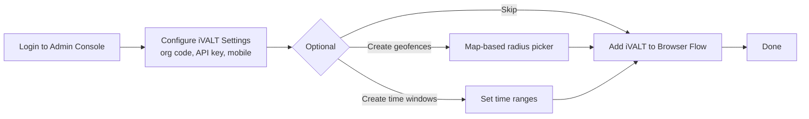
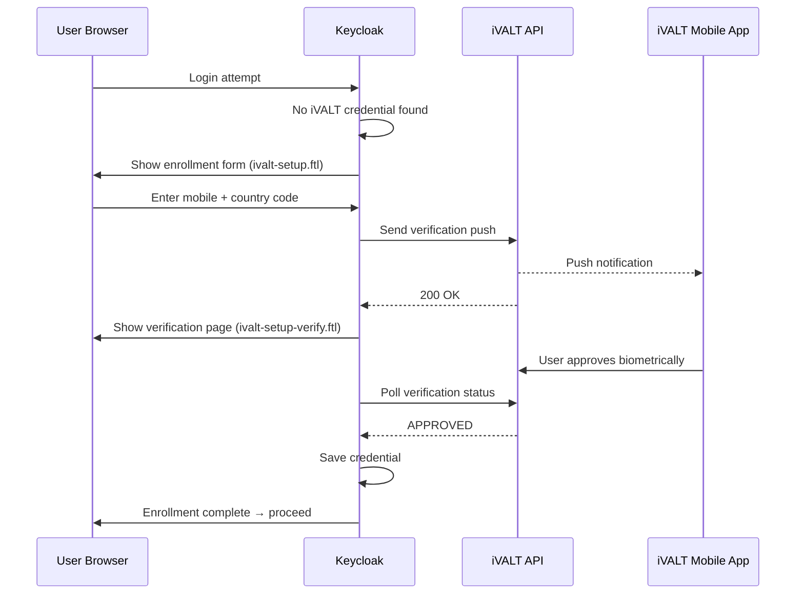
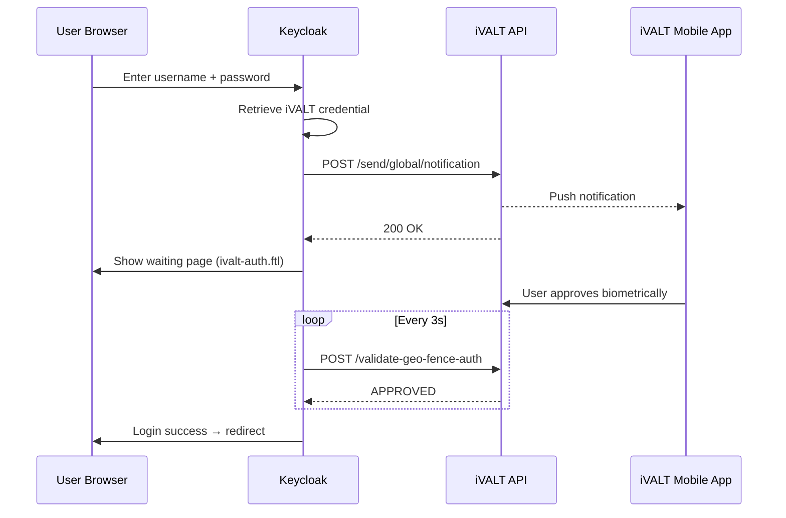
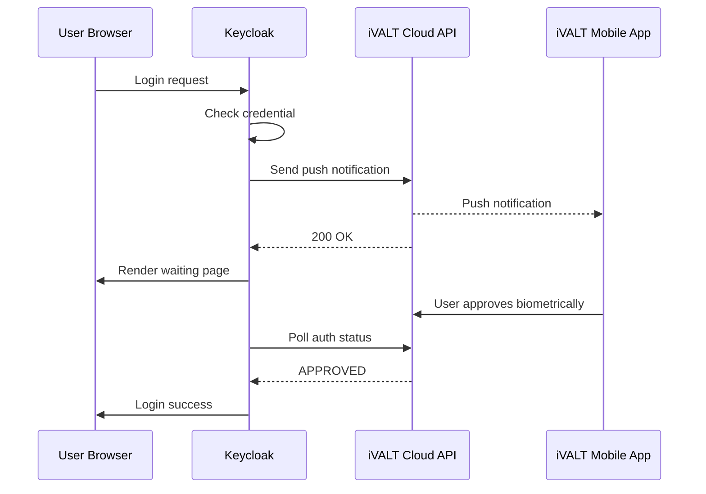
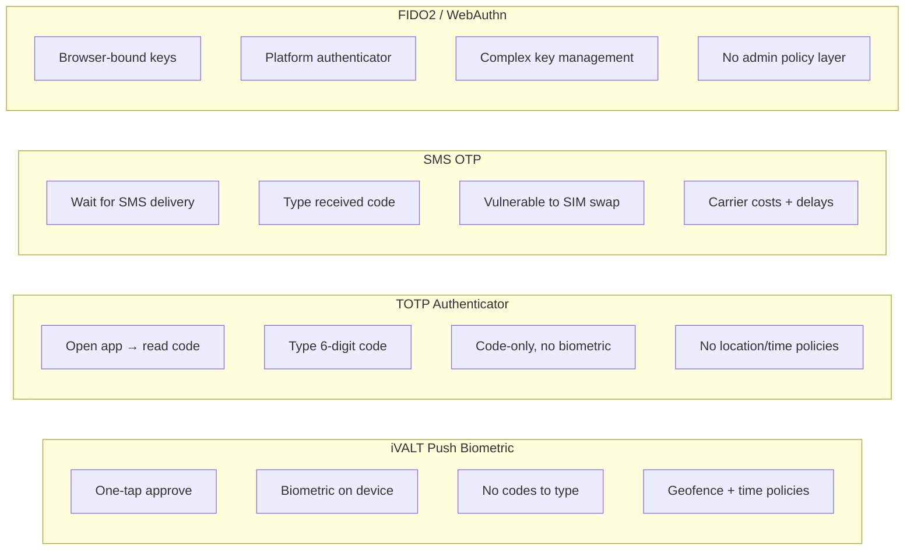
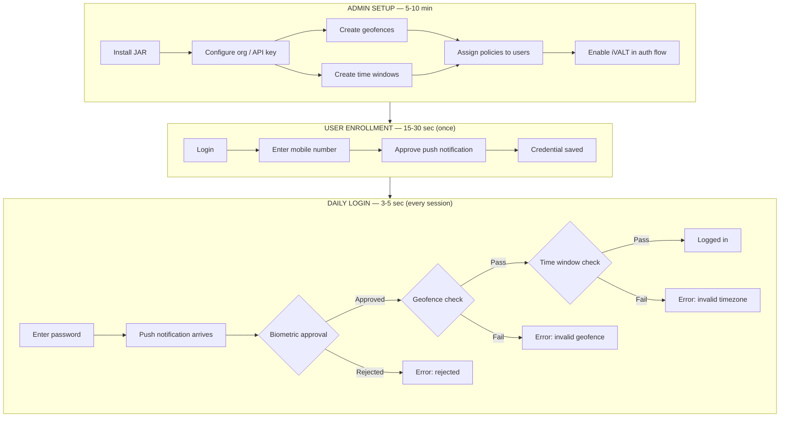

# iVALT MFA — User Flow & Story

## Overview

iVALT is a push-notification-based biometric MFA solution integrated with Keycloak. Instead of typing OTPs or scanning QR codes, users receive a push notification on their mobile device and authenticate with their fingerprint or face. The system also supports **geofencing** (location-based access control) and **time windows** (time-based access control) for granular security policies.

---

## The Story: Three Personas

### Persona 1 — The Admin (Configuration)

**Who:** IT administrator managing authentication policies.

**Goal:** Deploy strong MFA without hardware tokens or SMS costs.

**What they need:**

1. **Install the iVALT provider** — drop the JAR into Keycloak, configure the authentication flow
2. **Configure organization settings:**
   - Org code, API key, API base URL
   - Admin mobile number (used as the owner account for API access)
3. **Create security policies (optional):**
   - **Geofences:** Draw areas on a map (e.g., "Office HQ", "Warehouse Zone A") with configurable radius
   - **Time windows:** Define allowed hours (e.g., "Business Hours 9 AM–6 PM", "Weekends Only")
4. **Assign policies to users:**
   - Open any user record → GeoFence tab → assign geofences
   - Open any user record → TimeWindow tab → assign time windows
5. **Choose authentication strategy:**
   - **Mandatory:** Every user must enroll iVALT (flow requirement = REQUIRED)
   - **Self-service:** Only users who choose to enroll use iVALT (flow requirement = CONDITIONAL)

**Admin flow summary:**

---

### Persona 2 — The End User (Enrollment)

**Who:** An employee or customer who needs to set up iVALT MFA.

**Goal:** Register their mobile device in under a minute.

**What happens:**

1. User attempts to log in
2. Keycloak detects they have no iVALT credential
3. User sees the **enrollment page** (`ivalt-setup.ftl`) — a simple form:
   - Country code dropdown (e.g., +1, +91, +44)
   - Mobile number input
4. User enters their number and submits
5. A push notification is sent to the **iVALT mobile app** on their phone
6. User opens the notification and **approves biometrically** (fingerprint / face)
7. Keycloak confirms the approval → saves the mobile number as a credential
8. Enrollment complete — user proceeds to login

**Enrollment flow summary:**

**Time:** ~15–30 seconds.

---

### Persona 3 — The End User (Daily Login)

**Who:** An enrolled user authenticating for their regular workday.

**Goal:** Log in with one tap — no codes, no tokens.

**What happens:**

1. User enters username/password on the login page
2. Keycloak executes the iVALT authenticator
3. User sees the **auth waiting page** (`ivalt-auth.ftl`) — a clean screen with:
   - "A notification has been sent to your device"
   - Spinner/animation indicating the system is waiting
4. Push notification arrives on the user's phone via the iVALT app
5. User taps the notification → biometric prompt appears
6. User authenticates with fingerprint or face
7. Keycloak detects approval → login succeeds → user is redirected to the app

**What can go wrong (and what the user sees):**

| Scenario | User Experience |
|----------|----------------|
| ✅ Approved | Login proceeds normally |
| ❌ Rejected | Error message: "Authentication rejected" |
| ⏱ Timeout (~60s) | Error message: "Authentication timed out. Please try again." |
| 🌍 Outside allowed geofence | Error: "Invalid geofence — you are outside the allowed area" |
| 🕐 Outside allowed time window | Error: "Invalid timezone/time — outside allowed hours" |

**Daily login flow summary:**

**Total time:** ~3–5 seconds.

---

## How It Works (Technical Story)

### Authentication Sequence

The complete technical flow across all four participants shows how the browser, Keycloak, iVALT Cloud API, and mobile app interact during a successful login.

### What Makes It Different

iVALT's push-based biometric approach differs from traditional MFA methods in several important ways. The following comparison highlights where each method excels and where it falls short.

**iVALT vs. TOTP (Google/Microsoft Authenticator):** TOTP requires users to open an authenticator app, read a rotating 6-digit code, and type it into the login page. iVALT eliminates both steps — the push is proactive and approval is a single biometric tap. There is no QR code scanning after initial setup. TOTP codes are also vulnerable to phishing (users can be tricked into typing codes on fake sites), whereas push notifications cannot be intercepted the same way.

- No codes to type → faster login
- No QR code scanning needed for daily use
- Push is proactive — the user doesn't need to open an app and look up a code
- Biometric verification tied to the device (fingerprint/face), not just a code
- Push notification cannot be phished — no shareable secret

**iVALT vs. SMS OTP:** SMS OTP relies on cellular networks, which introduces delivery delays, carrier costs, and SIM-swap vulnerabilities where attackers port a victim's number to their own SIM. iVALT uses data-based push notifications that work over WiFi or mobile data worldwide, with no per-message cost and no reliance on cellular infrastructure.

- No SMS delivery delays or failures
- No carrier costs
- No SIM-swap vulnerability
- Works internationally without carrier dependencies

**iVALT vs. FIDO2/WebAuthn:** FIDO2 provides strong hardware-bound authentication but requires per-device registration and browser-level key management. Roaming credentials (security keys) add hardware costs. iVALT keeps the cryptographic operations on the user's phone via push, with no browser extensions or security keys needed. Additionally, iVALT's admin-defined geofence and time window policies provide a layer of access control that FIDO2 does not offer natively.

- No browser/RSA key management
- Push works across any device — the phone handles the crypto
- Admin policies (geofences, time windows) give additional control beyond device auth

---

## Benefits

### For End Users

| Benefit | Why It Matters |
|---------|---------------|
| **One-tap login** | Approve with fingerprint/face — no codes to read or type |
| **Fast** | ~3–5 second authentication, no app-switching |
| **Simple enrollment** | Enter mobile number, approve push — done in 30 seconds |
| **Works globally** | Push notifications work over WiFi or mobile data worldwide |
| **No extra hardware** | Uses the phone the user already carries |

### For Administrators

| Benefit | Why It Matters |
|---------|---------------|
| **Zero SMS costs** | Push notifications are free — no per-message charges |
| **Geofence policies** | Restrict access to physical locations (office, warehouse, etc.) |
| **Time window policies** | Restrict access to business hours or specific schedules |
| **Per-user policy assignment** | Fine-grained control — different rules for different roles |
| **Self-service enrollment** | Users register themselves — no IT help desk tickets |
| **Standard Keycloak integration** | Plugs into existing authentication flows, themes, and policies |

### Security

| Aspect | How iVALT Handles It |
|--------|----------------------|
| **Phishing resistance** | Push notifications can't be phished — no code to intercept |
| **Biometric verification** | Fingerprint/face on device — not a shared secret |
| **Location control** | Geofences prevent auth from outside approved areas |
| **Time control** | Time windows prevent auth outside approved hours |
| **Device binding** | Auth is tied to the registered mobile device |

---

## The Complete Journey (Visual)

The full lifecycle spans three phases: the administrator sets up the system, the user enrolls once, and then authenticates daily.

---

## Key Details Summary

| Step | Who | What Happens | Time |
|------|-----|-------------|------|
| Setup | Admin | Configure org, API key, policies | 5–10 min |
| Enroll | User | Enter mobile → approve push | 15–30 sec |
| Login | User | Receive push → biometric approval | 3–5 sec |

| User State | Flow Behavior |
|------------|---------------|
| Not enrolled, REQUIRED flow | Redirected to enrollment automatically |
| Not enrolled, CONDITIONAL flow | iVALT skipped — login proceeds without MFA |
| Enrolled | Push notification → biometric approval required |
| Enrolled + geofence assigned | Location verified before approval accepted |
| Enrolled + time window assigned | Time verified before approval accepted |

---

## Quick Reference: Files Involved

| File | What It Presents to the User |
|------|------------------------------|
| `ivalt-auth.ftl` | Waiting page with spinner — "Check your phone" |
| `ivalt-setup.ftl` | Enrollment form — country code + mobile number |
| `ivalt-setup-verify.ftl` | Verification waiting page — "Approve on your device" |
| `IvaltAuthenticator.java` | Sends push, polls API, handles auth result |
| `ConfigureIvalt.java` | Manages enrollment flow, stores credential |
| `IvaltCredentialProvider.java` | Reads/writes mobile number to Keycloak DB |
| `IvaltApiClient.java` | HTTP client for iVALT cloud API |
